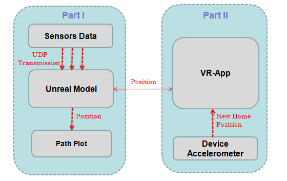

<!-- #######  #########-->
<h1>Project to bring a Simulink-based quadrocopter model to Google Cardboard VR </h1>
<h2>Description:</h2>

A quadrocopter-model based on MATLAB/Simulink will be used to show the behaviour of a quadrocopter in a virtual reality environment. The control of the object will be the movement of the head. 

The virtual reality device is a android smartphone with google cardboard. A google cardboard app will be developed with Unreal Engine 4 and the Google VR Plugin. This can be adapted to an Oculus Rift or HTC Vive device later.

The communication between the smartphone and the Simulink simulation goes via UDP communication.&nbsp;

<h2>Architecture:</h2>

-&nbsp;

<h2>Milestones and Tasks:</h2>
<table>
<thead>
<tr>
<td><strong>Tasks</strong></td>
<td><strong>Details</strong></td>
<td><strong>Done?</strong></td>
</tr>
</thead>
<tbody>
<tr>
<td>C++ Model for Position</td>
<td>Create model to calculate position based on sensor data</td>
<td>x</td>
</tr>
<tr>
<td>UDP connection</td>
<td>Receive data from Simulink model</td>
<td>&nbsp;</td>
</tr>
<tr>
<td>UDP connection</td>
<td>Send data to Simulink model</td>
<td></td>
</tr>
  <tr>
<td>UDP connection</td>
<td>Control Simulink model from C++</td>
<td></td>
</tr>
<tr>
<td>UDP connection</td>
<td>Establish protocol based connection between Simulink model and C++ program</td>
<td>Isn't this overlapped with the previous tasks</td>
</tr>
<tr>
<td>UDP connection</td>
<td>Receive data from the quadcopter</td>
<td>&nbsp;</td>
</tr>
<tr>
<td>Android App</td>
<td>Create first Android VR app running on a Smartphone (Unreal Engine 4)</td>
<td>&nbsp;</td>
</tr>
  <tr>
<td>Quadrocopter model</td>
<td>Create new Quadrocopter model (CAD)</td>
<td>&nbsp;</td>
</tr>
<tr>
<td>Quadrocopter model</td>
<td>Include Quadrocopter model to VR app</td>
<td>&nbsp;</td>
</tr>
<tr>
<td>UDP connection VR</td>
<td>Establish communication between VR app(using C++) and Simulink</td>
<td>&nbsp;</td>
</tr>
<tr>
<td>Include C++ model</td>
<td>Include the C++ model into the VR app</td>
<td>&nbsp;</td>
</tr>
  <tr>
<td>...</td>
<td>---</td>
<td>&nbsp;</td>
</tr>
</tbody>
</table>

&nbsp;

<h2>Build Info</h2>

Project created with Visual Studio 2013 
Packages: CppUnit - CppUnit test toolkit for C++ 
Libraries: boost_1_63_0 - For UDP Server and Client boost library is needed&nbsp;

