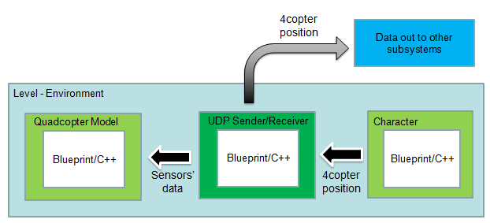
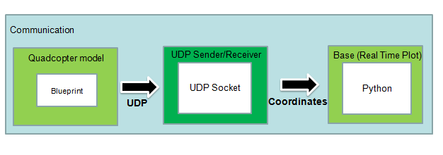
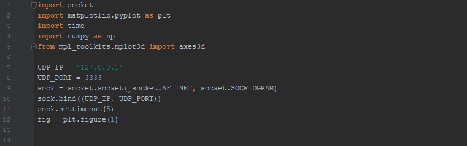

<!-- #######  #########-->
<h1>Project to bring a Simulink-based quadrocopter model to Google Cardboard VR </h1>
<h2>Description:</h2>

A quadrocopter-model based on MATLAB/Simulink will be used to show the behaviour of a quadrocopter in a virtual reality environment. The control of the object will be the movement of the head. 

The virtual reality device is a android smartphone with google cardboard. A google cardboard app will be developed with Unreal Engine 4 and the Google VR Plugin. This can be adapted to an Oculus Rift or HTC Vive device later.

The communication between the smartphone and the Simulink simulation goes via UDP communication.&nbsp;

<h2>Architecture:</h2>

-&nbsp;

<h2>Milestones and Tasks:</h2>
<table>
<thead>
<tr>
<td><strong>Tasks</strong></td>
<td><strong>Details</strong></td>
<td><strong>Done?</strong></td>
</tr>
</thead>
<tbody>
<tr>
<td>C++ Model for Position</td>
<td>Create model to calculate position based on sensor data</td>
<td>This is done using blueprint in Unreal Engine, the accelerations is being received and using tick to calculate the velocity in 3D</td>
</tr>
<tr>
<td>UDP connection</td>
<td>Receive data from Simulink model</td>
<td>Done using python, can received data from any sender...</td>
</tr>
<tr>
<td>UDP connection</td>
<td>Send data to Simulink model</td>
<td>In Progress... </td>
</tr>
  <tr>
<td>UDP connection</td>
<td>Control Simulink model from C++</td>
<td>Frame format already defined and agreed with Simulink Team </td>
</tr>
<tr>
<td>UDP connection</td>
<td>Establish protocol based connection between Simulink model and C++ program</td>
<td>This is not overlapped with the previous tasks</td>
</tr>
<tr>
<td>UDP connection</td>
<td>Receive data from the quadcopter</td>
<td>C++ functions are provided by Markus, the integration to UE4 blueprint is in progress</td>
</tr>
<tr>
<td>Android App</td>
<td>Create first Android VR app running on a Smartphone (Unreal Engine 4)</td>
<td>Done</td>
</tr>
  <tr>
<td>Quadrocopter model</td>
<td>Create new Quadrocopter model (CAD)</td>
<td>Basic Model done, the model is created using unreal</td>
</tr>
<tr>
<td>Quadrocopter model</td>
<td>Include Quadrocopter model to VR app</td>
<td>Basic Model done, including animations of the quadcopter propellers</td>
</tr>
<tr>
<td>UDP connection VR</td>
<td>Establish communication between VR app(using C++) and Simulink</td>
<td>In Progress...</td>
</tr>
<tr>
<td>Include C++ model</td>
<td>Include the C++ model into the VR app</td>
<td>In Progress...</td>
</tr>
  <tr>
<td>...</td>
<td>---</td>
<td>&nbsp;</td>
</tr>
</tbody>
</table>

&nbsp;

<h1>Unreal Model:</h1>
<h2>-Block Diagram-</h2>

The block diagram describes the architecture of the visual simulation of Unreal Engine 4. The environment(or level in Unreal Engine) contains a representation of the user, which will provide basic movements such as go forward, turn left, turn right...
Beside that, the level also contains Actors, which is interactable objects. The interacting function such as collitions or control or user's actions will create an event that triggers the movement of the object according to physical principles. 
Moreover, Unreal can also send/receive UDP/TCP data packages from outside with the help of local C++ functions.&nbsp;

<h2>-Enviroment-</h2>

The image shows how the environment looks like.&nbsp;

<h2>-Character-</h2>

The image shows how the environment looks like.&nbsp;

<h1>Real Time Path Plot:</h1>
<h2>-Block Diagram-</h2>

The block diagram depicts the architecture of the model for printing the current Quadracopter path.

The code is showed bellow:
&nbsp;

  

<h2>Build Info</h2>

Project created with Visual Studio 2013 
Packages: CppUnit - CppUnit test toolkit for C++ 
Libraries: boost_1_63_0 - For UDP Server and Client boost library is needed&nbsp;

